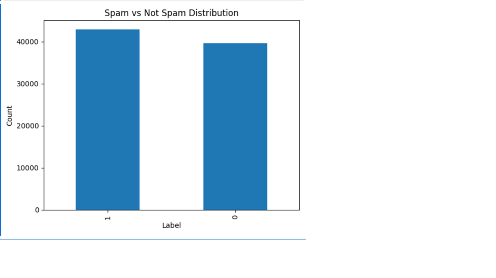
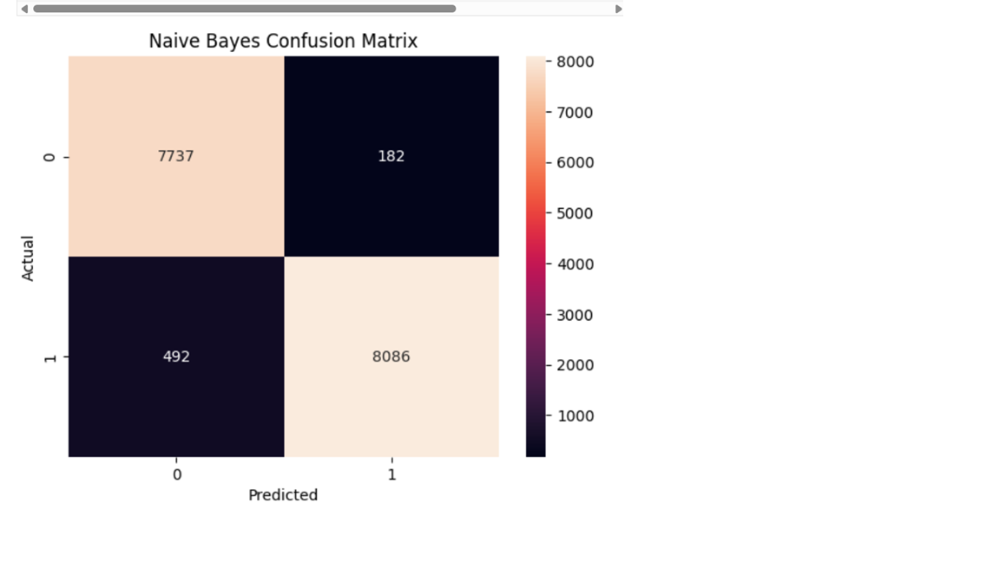
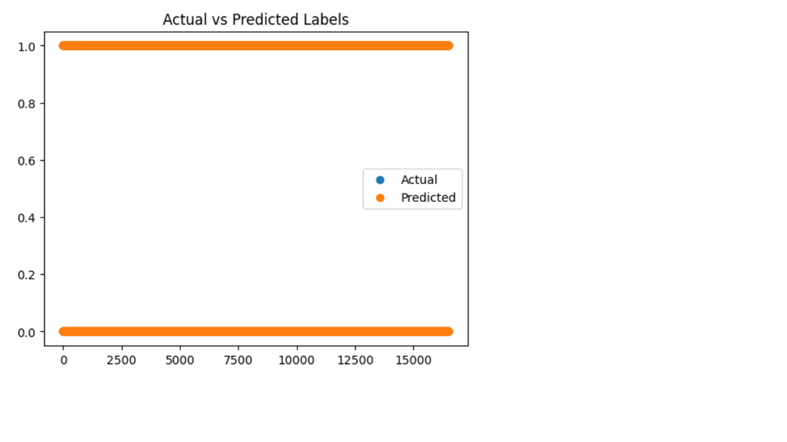

# 📧 Email Spam Detection using Machine Learning

A Machine Learning project that classifies emails as **Spam** or **Not Spam (Ham)** using Natural Language Processing (NLP) techniques and the Naive Bayes classification algorithm.

This project demonstrates the complete machine learning workflow, including data preprocessing, feature extraction using TF-IDF, model training, evaluation, visualization, and model serialization for future use.

## 📖 Project Overview

Spam emails are one of the biggest challenges in email communication. This project builds an intelligent email classification system capable of automatically identifying spam emails based on their textual content.

The project applies Natural Language Processing (NLP) to clean and transform email text before training a Naive Bayes classifier.


## ✨ Features

- Email text preprocessing
- Text cleaning and normalization
- TF-IDF Vectorization
- Naive Bayes Classification
- Model Evaluation
- Confusion Matrix Visualization
- Spam Distribution Visualization
- Prediction Plot
- Save Trained Model (.pkl)
- Save TF-IDF Vectorizer (.pkl)

## 🛠 Technologies Used

- Python
- Jupyter Notebook
- Pandas
- NumPy
- Scikit-learn
- Matplotlib
- Joblib

## 📂 Project Structure
email-spam-detection-ml/
│
├── images/
│   ├── confusion_matrix.png
│   ├── prediction_plot.png
│   └── spam_distribution.png
│
├── email_spam_detection.ipynb
├── spam_model.pkl
├── tfidf_vectorizer.pkl
├── requirements.txt
├── README.md
└── .gitignore

## 📊 Model Workflow

1. Load Dataset
2. Data Cleaning
3. Text Preprocessing
4. TF-IDF Feature Extraction
5. Train-Test Split
6. Train Naive Bayes Model
7. Model Evaluation
8. Save Model
9. Predict New Emails


## 📈 Visualizations
 Spam Distribution



Confusion Matrix



 Prediction Plot



## 📦 Dataset

The original dataset (`phishing_email.csv`) is **not included** in this repository because it exceeds GitHub's **100 MB file size limit**.

To run this project locally, place the dataset in the project root directory with the filename:
phishing_email.csv

## 🚀 Installation

Clone the repository

```bash
git clone https://github.com/janhavideore751/email-spam-detection-ml.git

Move into the project directory

```bash
cd email-spam-detection-ml

Install the required libraries

```bash
pip install -r requirements.txt
```

Open the notebook

```bash
jupyter notebook

## ▶️ Running the Project

1. Open the notebook.
2. Run all the cells.
3. Train the model.
4. Evaluate the model.
5. Save the trained model.
6. Test predictions using new email text.

## 📁 Saved Files

After training, the following files are generated:

- spam_model.pkl
- tfidf_vectorizer.pkl

These files can be used later without retraining the model.

## 🔮 Future Improvements

- Support multiple machine learning algorithms
- Deploy using Flask or Streamlit
- Real-time email classification
- Deep Learning implementation
- Email phishing detection
- Web-based user interface

## 👩‍💻 Author
"Janhavi Deore"
Computer Engineering Student
Interested in Artificial Intelligence, Machine Learning, Data Science, and Software Development.

## ⭐ If you found this project useful, don't forget to star the repository.
